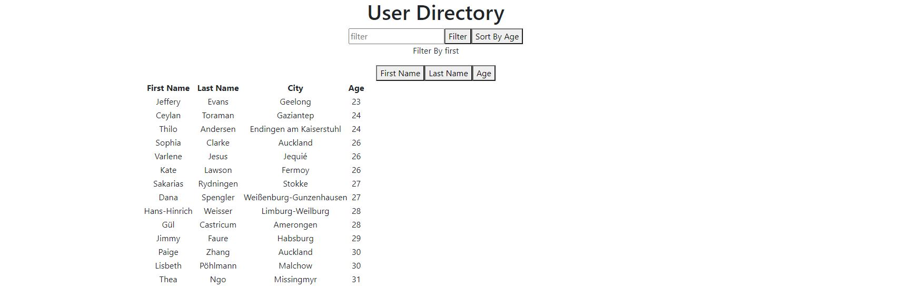

# User Directory

## Table of Contents
[Description](#description)

[Installation](#installation)

[Usage](#usage)

[Credits](#credits)

## Description
This repository contains a React Web application. This app allows a user look up and filter users in a large database.

### Main page
    Displays a table containing user data and a filter function

## Installation
Downloading respository. In directory run npm install.

## Usage
The application is deployed to https://whispering-coast-93845.herokuapp.com/.
Server can be run in test usage with node server.js command.

## Credits
Made By Andrew Ehrman.

### Components Used
Node
React

npm packages

    "@testing-library/jest-dom": "^5.11.9",

    "@testing-library/react": "^11.2.5",

    "@testing-library/user-event": "^12.8.1",

    "bootstrap": "^4.6.0",

    "react": "^17.0.1",

    "react-dom": "^17.0.1",

    "react-scripts": "4.0.3",

    "web-vitals": "^1.1.0"